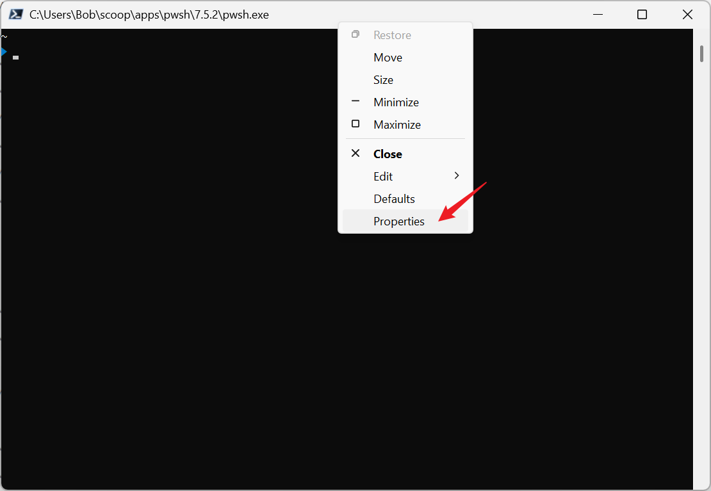
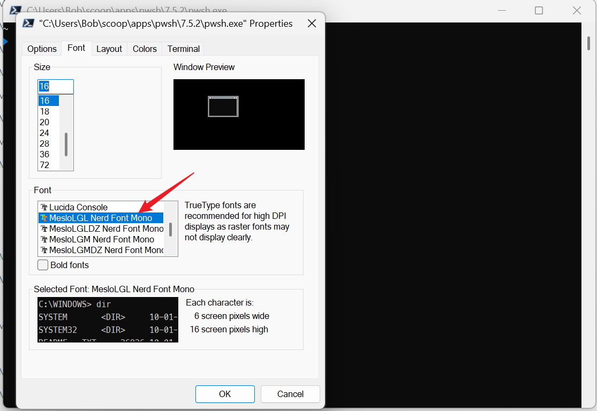
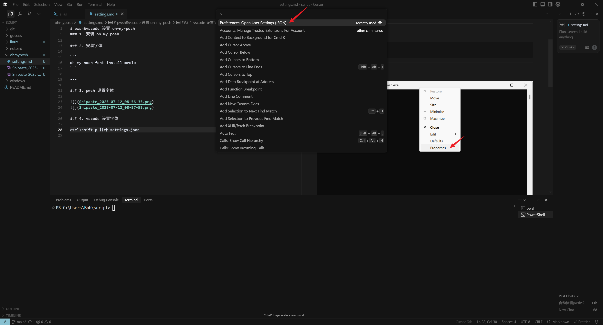
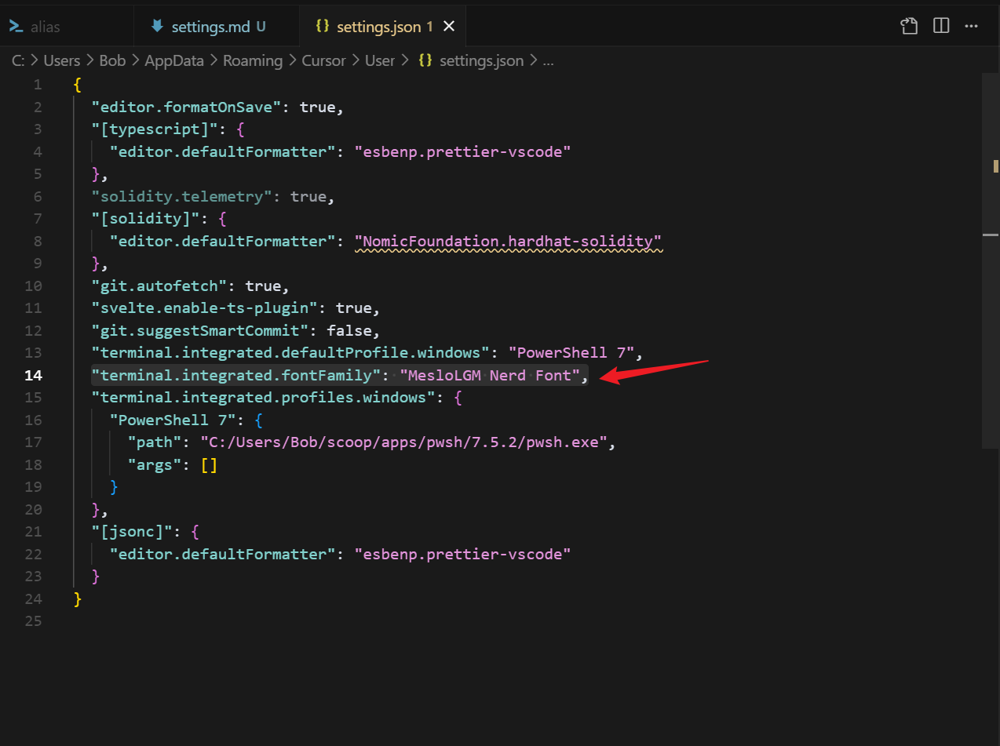

# Oh-My-Posh 配置指南

> 🎨 美化 PowerShell 和 VS Code 终端体验的完整指南

## 📋 目录

- [简介](#简介)
- [前置要求](#前置要求)
- [安装步骤](#安装步骤)
  - [1. 安装 Oh-My-Posh](#1-安装-oh-my-posh)
  - [2. 安装 Nerd Fonts 字体](#2-安装-nerd-fonts-字体)
  - [3. 配置 PowerShell](#3-配置-powershell)
  - [4. 配置 VS Code](#4-配置-vs-code)
- [主题配置](#主题配置)
- [常见问题](#常见问题)
- [进阶配置](#进阶配置)

---

## 📖 简介

[Oh-My-Posh](https://ohmyposh.dev/) 是一个跨平台的提示符引擎，可以为 PowerShell、Bash、Zsh 等 shell 提供美观的提示符。它支持：

- 🎨 丰富的主题和图标
- ⚡ 高性能渲染
- 🔧 高度可定制
- 🌈 支持 Git 状态显示
- 📊 系统信息展示

## ✅ 前置要求

- Windows 10/11
- PowerShell 5.1+ 或 PowerShell Core 6+
- [Scoop](https://scoop.sh/) 包管理器
- VS Code（可选）

---

## 🚀 安装步骤

### 1. 安装 Oh-My-Posh

使用 Scoop 安装 Oh-My-Posh：

```powershell
# 安装 Oh-My-Posh
scoop install oh-my-posh

# 验证安装
oh-my-posh --version
```

### 2. 安装 Nerd Fonts 字体

Oh-My-Posh 需要支持图标的字体才能正确显示：

```powershell
# 安装 Meslo Nerd Font
oh-my-posh font install meslo

# 或者安装其他推荐的字体
oh-my-posh font install cascadiacode
oh-my-posh font install hack
```

### 3. 配置 PowerShell

#### 3.1 设置 PowerShell 字体

1. 打开 PowerShell 设置：

   - 右键点击 PowerShell 窗口标题栏
   - 选择"属性" → "字体"选项卡

2. 选择已安装的 Nerd Font：
   - **MesloLGM Nerd Font**（推荐）
   - **Cascadia Code Nerd Font**
   - **Hack Nerd Font**




#### 3.2 配置 PowerShell Profile

创建或编辑 PowerShell Profile：

```powershell
# 查看 Profile 路径
$PROFILE

# 创建 Profile（如果不存在）
if (!(Test-Path -Path $PROFILE)) {
    New-Item -ItemType File -Path $PROFILE -Force
}

# 编辑 Profile
notepad $PROFILE
```

在 Profile 中添加以下内容：

```powershell
# 基础配置
oh-my-posh init pwsh | Invoke-Expression

# 使用自定义主题（可选）
oh-my-posh init pwsh --config 'https://github.com/JanDeDobbeleer/oh-my-posh/blob/main/themes/avit.omp.json' | Invoke-Expression
```

### 4. 配置 VS Code

#### 4.1 打开 VS Code 设置

1. 按 `Ctrl+Shift+P` 打开命令面板
2. 输入 "Preferences: Open Settings (JSON)"
3. 选择该选项打开 `settings.json`



#### 4.2 配置终端字体

在 `settings.json` 中添加：

```json
{
  "terminal.integrated.fontFamily": "MesloLGM Nerd Font",
  "terminal.integrated.fontSize": 14,
  "terminal.integrated.lineHeight": 1.2
}
```



---

## 🎨 主题配置

### 内置主题

Oh-My-Posh 提供了多种内置主题：

```powershell
# 查看所有可用主题
Get-ChildItem $env:POSH_THEMES_PATH

# 使用不同主题
oh-my-posh init pwsh --config "$env:POSH_THEMES_PATH\agnoster.omp.json" | Invoke-Expression
oh-my-posh init pwsh --config "$env:POSH_THEMES_PATH\powerlevel10k_rainbow.omp.json" | Invoke-Expression
oh-my-posh init pwsh --config "$env:POSH_THEMES_PATH\paradox.omp.json" | Invoke-Expression
```

### 自定义主题

创建自定义主题文件：

```powershell
# 创建主题目录
mkdir $env:USERPROFILE\.poshthemes

# 创建自定义主题文件
notepad $env:USERPROFILE\.poshthemes\custom.omp.json
```

示例自定义主题：

```json
{
  "$schema": "https://raw.githubusercontent.com/JanDeDobbeleer/oh-my-posh/main/themes/schema.json",
  "version": 1,
  "blocks": [
    {
      "type": "prompt",
      "alignment": "left",
      "segments": [
        {
          "type": "path",
          "style": "plain",
          "properties": {
            "style": "folder",
            "max_depth": 1
          }
        },
        {
          "type": "git",
          "style": "plain",
          "properties": {
            "display_stash_count": true,
            "display_upstream_icon": true
          }
        }
      ]
    }
  ]
}
```

---

## ❓ 常见问题

### Q: 图标显示为方块或问号？

**A:** 确保安装了 Nerd Fonts 字体，并在终端中正确设置字体。

### Q: 提示符加载缓慢？

**A:** 可以禁用某些模块或使用更简单的主题：

```powershell
# 使用轻量级主题
oh-my-posh init pwsh --config "$env:POSH_THEMES_PATH\minimal.omp.json" | Invoke-Expression
```

### Q: Git 状态不显示？

**A:** 确保在 Git 仓库中，并且 Git 已正确安装：

```powershell
# 检查 Git 安装
git --version
```

### Q: 如何临时禁用 Oh-My-Posh？

**A:** 在 PowerShell 中执行：

```powershell
# 临时禁用
$env:POSH_DISABLE = 1

# 重新启用
$env:POSH_DISABLE = 0
```

---

## 🔧 进阶配置

### 性能优化

```powershell
# 在 Profile 中添加性能优化
$env:POSH_DISABLE_GIT_STATUS = $false
$env:POSH_DISABLE_KUBECTL = $true  # 如果不需要 kubectl 信息
```

### 快捷键配置

在 VS Code 的 `keybindings.json` 中添加：

```json
{
  "key": "ctrl+shift+`",
  "command": "workbench.action.terminal.toggleTerminal"
}
```

### 集成其他工具

```powershell
# 集成 PSReadLine（自动补全）
Import-Module PSReadLine
Set-PSReadLineOption -PredictionSource History
Set-PSReadLineOption -PredictionViewStyle ListView
```

---

## 📚 相关资源

- [Oh-My-Posh 官方文档](https://ohmyposh.dev/)
- [Nerd Fonts 官网](https://www.nerdfonts.com/)
- [PowerShell 主题库](https://github.com/JanDeDobbeleer/oh-my-posh/tree/main/themes)
- [VS Code 终端配置](https://code.visualstudio.com/docs/terminal/basics)

---

<div align="center">

**🎉 恭喜！你的终端现在应该更加美观和实用了！**

如果遇到问题，请检查 [常见问题](#常见问题) 部分或查看官方文档。

</div>
